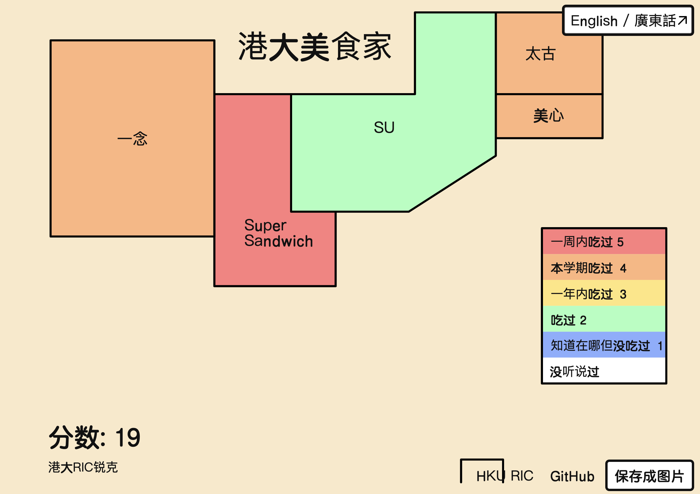

# HKU 美食地图

<!-- https://food.lvwzhen.com/ -->

## 功能
可以在线标记 天天吃、会做、喜欢、吃过、害怕 标记后可生成图片进行社区分享

标记过的信息会记录到本地存储，有什么新进展再次打开网页更新即可

## 说明
简化地图在保留了地缘相接特征的基础上把省级行政区域尽可能简化成了方框，目标是把省级行政区域之间的关系通过画面展现到一目了然的程度

仅三十四省级行政区域可标记，九段线西沙群岛在地图上有标示

## 提示
请使用自带浏览器进行保存

## 其他版本
<!-- - 全球版：https://lab.magiconch.com/world-ex/
- 中国版：https://lab.magiconch.com/china-ex/
- 美国版：https://tenpages.github.io/us-level/us.html
- 欧洲版：https://tenpages.github.io/us-level/eu.html
- 日本版：https://zhung.com.tw/japanex/ -->

